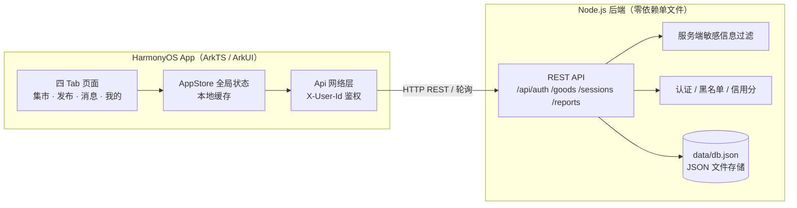

# 杉达集市 Sanda Market

> 上海杉达学院校园生活交易市场 —— 开源创新实践微专业 / 开源社团活动实践项目

一个面向在校学生的校园二手交易与互助服务 App，**以安全信任为核心设计目标**：
本校学生认证、全链路隐私信息过滤、单方拒聊 / 拉黑、信用分体系，覆盖二手教材、
校园跑腿（快递代拿 / 外卖 / 食堂代选）与求助专区（失物招领 / 悬赏求助）。

## 功能特性

### 安全信任（核心）
- **学生认证**：姓名 + 学号 + 学院提交校方认证，通过后信用分 +2，学号服务端脱敏存储（`23****17`）
- **隐私信息强制过滤**：手机号 / 微信 / QQ / 学号 / 银行卡号在聊天消息与商品文案中自动打码，
  **由服务端强制执行**，客户端仅做输入提示，无法绕过
- **单方拒聊**：任意一方可拒绝会话，对方立即无法继续发送
- **拉黑**：拉黑后双通道关闭并注入系统提示，可随时解除
- **举报**：举报记录可查，被举报者信用分 -2
- **信用分**：认证 / 违规动态增减，展示为可信等级

### 业务功能
- **二手教材**：品相分级（九成新 / 七成新 / 有笔记 / 较旧）
- **校园跑腿**：快递代按 **份数 + 大小（S/M/L/XL）+ 重量（>5kg / >10kg 加价）** 公平计价；
  外卖跑腿按份数计价
- **食堂代选**：窗口菜单选菜 + 口味备注（辣度 / 葱花等），按份数计价
- **求助专区**：失物招领、悬赏求助
- **实时聊天**：轮询同步（2.5s 会话 / 5s 列表），消息自动脱敏

## 技术架构



| 层 | 技术 | 说明 |
|---|---|---|
| 客户端 | ArkTS + ArkUI（状态管理 V2） | Navigation + Tabs，DevEco Studio 构建 |
| 网络层 | `@kit.NetworkKit` http | `X-User-Id` 头身份鉴权，DTO 强类型解析 |
| 后端 | Node.js 原生 `http` 模块 | **零依赖**单文件 `server.js`，端口 3000 |
| 存储 | JSON 文件（`data/db.json`） | 首次运行自动写入种子数据 |
| 消息同步 | HTTP 轮询 | 聊天页 2.5s、会话列表 5s（可升级 WebSocket） |

## 快速开始

### 1. 启动后端（需 Node.js 18+）

```bash
cd backend
node server.js
# 服务监听 0.0.0.0:3000，健康检查 GET /api/health → {"ok":true}
```

### 2. 运行 App（需 DevEco Studio + 模拟器）

1. DevEco Studio 打开工程根目录，等待 Sync 完成
2. 设备管理器创建 / 启动一个 Phone 模拟器
3. 点击 **Run 'entry'**

模拟器访问宿主机后端使用默认地址 `http://10.0.2.2:3000`；
**真机调试**请修改 [ApiConfig.ets](entry/src/main/ets/common/ApiConfig.ets) 中的 `BASE_URL`
为电脑局域网 IP（如 `http://192.168.1.100:3000`）。

## 目录结构

```
├── AppScope/                     # 应用级配置
├── entry/src/main/ets/
│   ├── entryability/             # 入口 Ability（preferences 记住用户身份）
│   ├── pages/                    # Index（Navigation + 四 Tab）与子页面
│   │   ├── Index.ets             # 路由宿主：detail / chat / certify / blocks
│   │   ├── HomePage.ets          # 集市：搜索 / 分类筛选 / 商品卡片
│   │   ├── PublishPage.ets       # 发布：教材 / 跑腿（份数·大小·重量）/ 食堂代选 / 求助
│   │   ├── MessagePage.ets       # 会话列表（5s 轮询）
│   │   ├── ChatPage.ets          # 聊天（2.5s 轮询 / 拒聊 / 拉黑 / 举报）
│   │   ├── DetailPage.ets        # 商品详情 + 卖家信用
│   │   ├── CertifyPage.ets       # 学生认证
│   │   └── BlockListPage.ets     # 黑名单管理
│   ├── views/                    # 通用组件（GoodsCard / TagBadge / Avatar …）
│   ├── common/
│   │   ├── AppStore.ets          # 全局状态：服务端数据缓存 + 业务动作
│   │   ├── Api.ets               # REST 客户端 + DTO
│   │   ├── ApiConfig.ets         # 服务器地址
│   │   └── SensitiveFilter.ets   # 客户端敏感信息提示（与服务端同规则）
│   └── model/Models.ets          # 实体与会话状态机
└── backend/
    └── server.js                 # 零依赖 REST 服务（含种子数据与服务端过滤）
```

## REST API 概览

| 方法 & 路径 | 说明 |
|---|---|
| `POST /api/auth/guest` | 访客注册 / 找回身份（传 `id`） |
| `POST /api/auth/certify` | 学生认证（学号脱敏，信用 +2） |
| `GET / POST /api/goods` | 商品列表 / 发布（发布需已认证，文案强制脱敏） |
| `GET /api/goods/:id` | 商品详情（内嵌卖家信息） |
| `GET / POST /api/sessions` | 会话列表 / 开聊（首条消息脱敏） |
| `GET /api/sessions/:id` | 会话详情（内嵌对方用户，轮询用） |
| `POST /api/sessions/:id/messages` | 发消息（拒聊 / 拉黑状态 409，强制脱敏） |
| `POST /api/sessions/:id/refuse` `…/resume` | 单方拒聊 / 恢复 |
| `POST /api/sessions/:id/demo` | 演示：模拟对方发送联系方式（体验打码） |
| `POST /api/users/:id/block` `…/unblock` | 拉黑 / 解除（黑名单双向 409） |
| `GET /api/blacklist` | 我的黑名单 |
| `POST /api/reports` · `GET /api/reports` | 举报（对方信用 -2）/ 我的举报记录 |

## 安全设计说明

- 敏感信息过滤规则**客户端与服务端各实现一份，服务端为准**：消息入库存脱敏文本并标记 `kind=Masked`，附带系统提示消息
- 会话状态机按参与者视角计算（`refused[]` / `blocked[]` 数组），天然支持“我拒绝了对方”与“对方拒绝了我”两种不同视图
- 发布商品需通过学生认证（服务端 403 校验），未认证用户仅可浏览与聊天
- 所有交易引导均可举报，信用分机制联动认证与举报

## License

[MIT](LICENSE)
